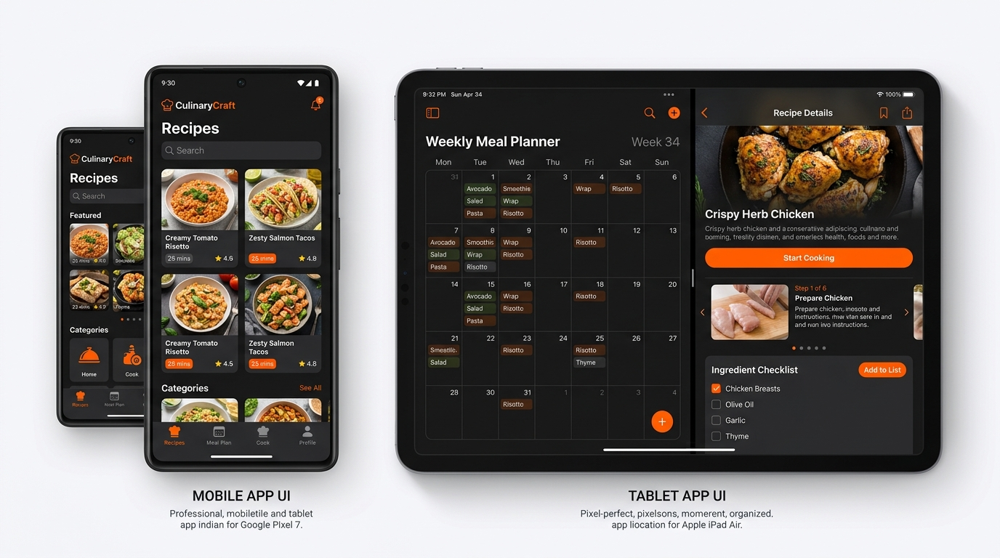
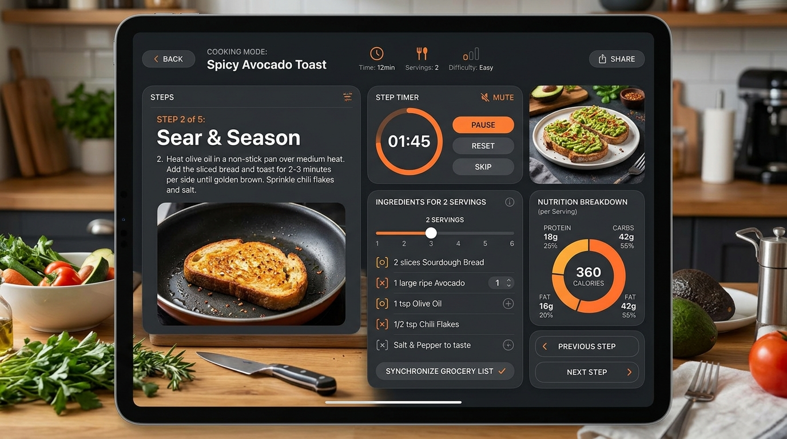

# 🍳 CulinaryHub — Modern Recipe Discovery & Meal Planning Suite

[](https://reactjs.org/)
[](https://www.typescriptlang.org/)
[](https://tailwindcss.com/)
[](https://vitejs.dev/)
[](https://developer.mozilla.org/en-US/docs/Web/API/Window/localStorage)

An aesthetic, dark-themed culinary application designed for home chefs, meal preppers, and fitness enthusiasts. **CulinaryHub** combines recipe discovery, interactive step-by-step cooking timers, a 7-day nutritional meal planner, smart grocery list aggregation, and comprehensive portion scaling in one unified interface.

---

## 📸 App Preview



---

## ✨ Core Features

### 1. 🔍 Recipe Exploration & Multi-Filter Engine
- **Curated Culinary Catalog**: Explore **32+ gourmet recipes** across Asian, Italian, Western, Mexican, Healthy, Seafood, Bakery, Soups, and Keto cuisines.
- **Smart Filtering & Sorting**: Filter by prep/cook time, difficulty level, dietary tags (Vegan, Gluten-Free, Keto, High-Protein), and sort by rating, fastest time, or lowest calories.
- **Instant Search**: Real-time fuzzy searching across titles, ingredients, chefs, and cuisine categories.

### 2. ⏱️ Live Step-by-Step Cooking Assistant
- **Focus Cooking Mode**: Distraction-free full-screen guided walkthrough for every recipe.
- **Built-in Smart Timers**: Interactive step timers with start/pause/reset controls and audio completion alerts.
- **Progress Tracking**: Visual step completion checklist ensuring no culinary stage is missed.



### 3. ⚖️ Dynamic Serving & Ingredient Scaler
- Adjust servings on the fly with automatic real-time recalculation of ingredient amounts, units, calories, and macronutrients (Protein, Carbs, Fat, Fiber).

### 4. 📅 7-Day Macro-Aware Meal Planner
- **Slot-Based Scheduling**: Organize dishes into Breakfast, Lunch, Dinner, and Snack slots across Monday through Sunday.
- **Daily Target Tracking**: Real-time progress bars comparing scheduled meals against user-configured daily calorie and protein goals.
- **One-Click Sync**: Synchronize all scheduled week ingredients directly into the shopping list with smart duplicate combining.

### 5. 🛒 Smart Categorized Grocery List
- **Aisle Categorization**: Automatically groups items into Produce, Meat & Poultry, Seafood, Dairy & Eggs, Pantry, Spices & Seasoning, and Bakery.
- **Interactive Checklists**: Strike off ingredients while shopping in the supermarket.
- **Custom Ingredients**: Add bespoke pantry items with custom amounts, units, and department tags.

### 6. ✍️ Custom Recipe Creator
- Build, edit, and save custom recipes with custom ingredients, categorized departments, cooking steps, preparation time, and step timer durations.

### 7. 💾 Local Data Persistence & Portability
- **Offline-First Storage**: All custom recipes, meal plans, favorites, and grocery items persist automatically in local storage.
- **JSON Backup & Restore**: Export full application state as a JSON backup file and restore anytime.

---

## 🛠️ Technology Stack

| Layer | Technology |
| :--- | :--- |
| **Framework** | [React 18](https://react.dev/) (Functional Components & Hooks) |
| **Language** | [TypeScript](https://www.typescriptlang.org/) for strict type safety |
| **Styling** | [Tailwind CSS](https://tailwindcss.com/) with custom dark slate palette |
| **Animations** | [Motion](https://motion.dev/) for smooth transitions |
| **Icons** | [Lucide React](https://lucide.dev/) |
| **Bundler** | [Vite](https://vitejs.dev/) |
| **Storage** | LocalStorage / In-Browser JSON State Engine |

---

## 🚀 Getting Started

### Prerequisites
- [Node.js](https://nodejs.org/) (version 18.0 or later)
- [npm](https://www.npmjs.com/) or [bun](https://bun.sh/)

### Installation & Local Setup

1. **Clone the repository**:
   ```bash
   git clone https://github.com/your-username/culinary-hub.git
   cd culinary-hub
   ```

2. **Install dependencies**:
   ```bash
   npm install
   ```

3. **Launch the development server**:
   ```bash
   npm run dev
   ```
   Open your browser and navigate to `http://localhost:3000`.

4. **Build for production**:
   ```bash
   npm run build
   ```

---

## 📁 Project Structure

```
├── public/                     # Static public assets
├── src/
│   ├── assets/                 # App preview images and visual assets
│   ├── components/             # Modular UI components
│   │   ├── FilterDrawer.tsx            # Multi-parameter recipe filter & sort drawer
│   │   ├── GroceryListView.tsx         # Categorized shopping checklist & custom item modal
│   │   ├── InteractiveCookingMode.tsx  # Full-screen guided step timer & cooking assistant
│   │   ├── MealPlannerView.tsx         # 7-Day calendar planner & macro targets
│   │   ├── ProfileModal.tsx            # Calorie targets & JSON database backup
│   │   ├── RecipeCard.tsx              # Interactive recipe display card
│   │   ├── RecipeCreatorModal.tsx      # Custom recipe builder form
│   │   ├── RecipeDetailView.tsx        # Recipe hero view, scaler, and macros
│   │   └── TopNavigation.tsx           # Global header with search and active views
│   ├── data/
│   │   └── initialRecipes.ts           # Curated library of 32 international recipes
│   ├── db/
│   │   └── storage.ts                  # Local database management & JSON export/import
│   ├── types.ts                        # Shared TypeScript interfaces & types
│   ├── App.tsx                         # Core application state & view routing
│   ├── main.tsx                        # Application DOM entry point
│   └── index.css                       # Global styles & Tailwind configuration
├── metadata.json               # App metadata configuration
├── package.json                # Project dependencies and npm scripts
├── tsconfig.json               # TypeScript compiler configuration
└── vite.config.ts              # Vite configuration
```

---

## 📱 Responsive & Mobile-First Design
- **Desktop**: Expansive bento-grid layouts with side-by-side nutrition panels, sticky action bars, and multi-column recipe explorer.
- **Mobile**: Ergonomic bottom sheets, touch-friendly 44px+ tap targets, swipeable category chips, and fixed bottom navigation bar.

---

## 📄 License
Distributed under the **MIT License**. Free for personal and commercial exploration.
